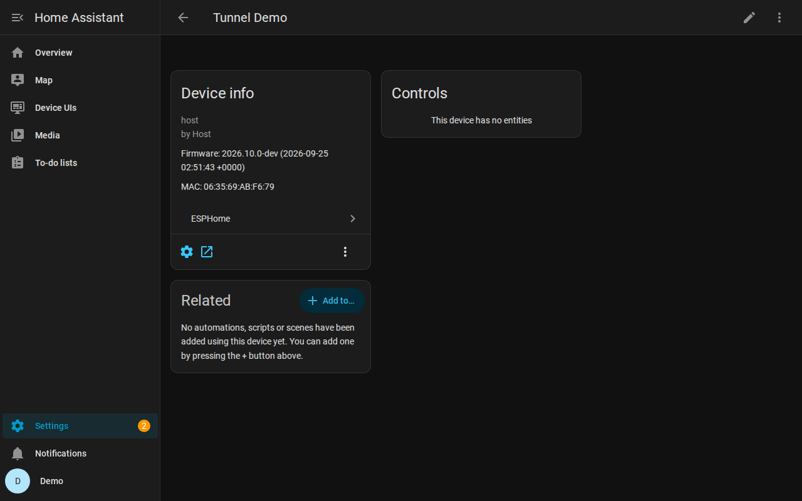

# PoC: device web UIs in Home Assistant, tunnelled over the ESPHome native API

A device's own web UI (ESPHome `web_server`, or anything else it can reach) shows up
inside Home Assistant. HA relays it over the existing encrypted API connection, so it
works wherever HA works: remotely, over HTTPS, in the companion app. No extra
reverse-proxy setup is needed.

| | |
|---|---|
|  |  |
| The device page's **Visit** button opens the panel | The device's UI, proxied through HA over the tunnel |

Read [docs/DESIGN.md](docs/DESIGN.md) for how it works end to end: the protocol, flow
control, security model, prior-art research, what was verified, and the path upstream.

## What is where

| Piece | Location |
|---|---|
| ESPHome `tcp_proxy` component | [`esphome/components/tcp_proxy/`](../esphome/components/tcp_proxy/) |
| Native API messages (ids 156–160, capabilities field 5) | [`esphome/components/api/api.proto`](../esphome/components/api/api.proto) (search `TCP PROXY`), generated `api_pb2*`, hooks in `api_connection.{h,cpp}` |
| Component config tests | [`tests/components/tcp_proxy/`](../tests/components/tcp_proxy/) |
| aioesphomeapi client (`APIClient.tcp_proxy_open`, `TcpProxyStream`) | [`aioesphomeapi/0001-Add-TCP-proxy-streams.patch`](aioesphomeapi/), based on aioesphomeapi `main` at `8c3be6d` (46.5.0) |
| HA custom integration (proxy, sessions, panel) | [`home-assistant/custom_components/esphome_web_ui/`](home-assistant/custom_components/esphome_web_ui/) |
| Demo firmware (host platform), stand-in UI, g++ build script | [`device/`](device/) |
| Test and demo scripts | [`tools/`](tools/) |

## Try it on real hardware

> Untested on hardware so far. See "Not verified" in DESIGN.md. It is ESP32 (ESP-IDF)
> or LibreTiny only.

**1. Firmware.** Install ESPHome from this branch (it is `2026.10.0-dev`):

```bash
pip install "git+https://github.com/ashald/esphome@claude/practical-fermat-sbmyi3"
```

```yaml
api:
  encryption:
    key: !secret api_key

web_server:
  port: 80
  version: 3

tcp_proxy:   # exposes web_server over the API
```

**2. Home Assistant** needs the patched aioesphomeapi, which is not released. The easiest
setup is HA Core in a venv:

```bash
git clone https://github.com/esphome/aioesphomeapi && cd aioesphomeapi
git checkout 8c3be6d8177fd38f41ce0abdf5a7f4fd8f58786c
git am /path/to/esphome/poc/aioesphomeapi/0001-Add-TCP-proxy-streams.patch
SKIP_CYTHON=1 pip install --no-deps .     # pure-Python build
hass --skip-pip-packages aioesphomeapi    # otherwise HA reinstalls its pinned version
```

- Copy `home-assistant/custom_components/esphome_web_ui` into `<config>/custom_components/`
  and restart HA.
- Add the **ESPHome device web UIs** integration from Settings → Devices & services.
- Open the device page and press **Visit**, or use **Device UIs** in the sidebar.

HA OS and Container cannot easily swap a core dependency, so there this has to wait for
upstream support.

## Reproduce the local demo

This is how everything was tested, with no hardware needed. It assumes Linux, `g++`,
Python 3.13 for ESPHome and Python ≥ 3.14.2 for HA.

```bash
# ESPHome env (from repo root)
pip install -e . -r requirements_test.txt

# HA env: HA 2026.9.3 + patched aioesphomeapi (pure Python)
pip install homeassistant==2026.9.3 aioesphomeapi==46.2.0 \
  esphome-dashboard-api==1.4.0 bleak-esphome==4.0.0
# ...then the patched aioesphomeapi exactly as in step 2 above

# 1. stand-in device UI on 127.0.0.1:8080 (web_server does not run on the host platform)
python poc/device/fake_device_ui.py 8080 &
# 2. firmware on the host platform (PlatformIO-free g++ build), API on 127.0.0.1:6053
poc/device/build_host.sh poc/device/tunnel-demo.yaml
poc/device/.esphome/build/tunnel-demo/program &
# 3. tunnel only: aioesphomeapi <-> firmware
python poc/tools/tunnel_smoke_test.py

# 4. Home Assistant with the integration
mkdir -p ha-config/custom_components
ln -s "$PWD/poc/home-assistant/custom_components/esphome_web_ui" ha-config/custom_components/
printf 'http:\nconfig:\nfrontend:\nonboarding:\n' > ha-config/configuration.yaml
hass -c ha-config --skip-pip-packages aioesphomeapi &
python poc/tools/ha_demo_setup.py tokens.json    # onboard, add ESPHome device + integration
python poc/tools/ha_proxy_check.py tokens.json   # HTTP/SSE/WebSocket/CORS through HA
NODE_PATH=$(npm root -g) node poc/tools/browser_demo.mjs tokens.json poc/docs/img  # Playwright
```

The demo firmware runs without API encryption only because `noise-c` could not be
downloaded in the sandbox where this was built. Keep `encryption:` on real devices.
