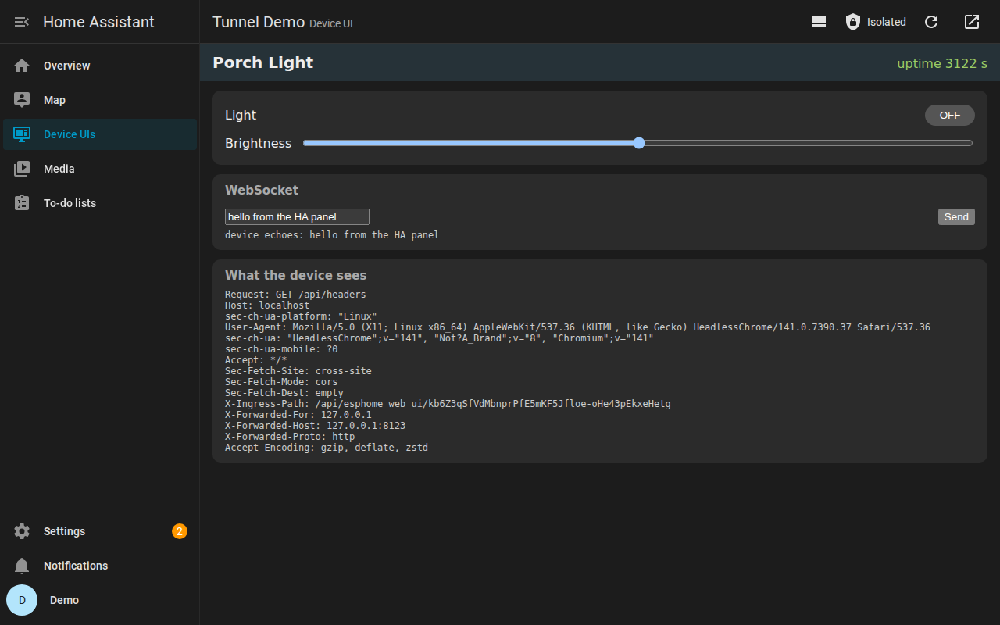
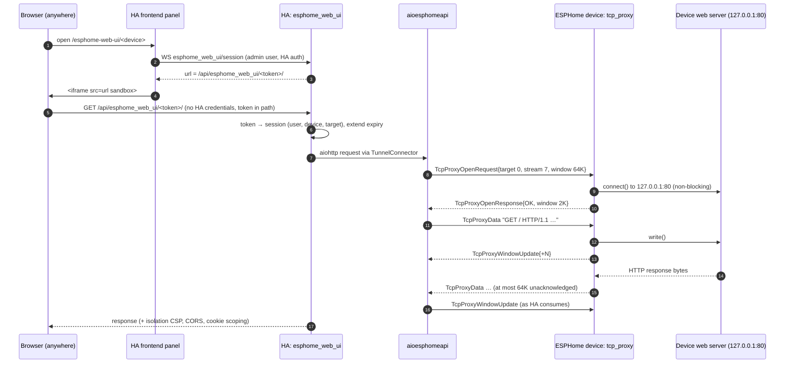

# Device web UIs inside Home Assistant, over the ESPHome native API

Proof of concept. This document covers how the pieces work end to end, and the
research behind the design.

## The problem

Many ESP devices serve a web UI on their own HTTP port. Examples are ESPHome's
`web_server`, WLED, the SMLIGHT SLZB-06 and the FutureProofHomes Satellite1 radar
tuner. Home Assistant links to these UIs from the device page ("Visit",
`configuration_url`), but it only *links* them.

- **It fails outside the LAN.** The link points at the device's LAN address. HA's own
  developer docs state this: "the URL linked to is not proxied by Home Assistant, so this
  typically won't work when connecting to Home Assistant remotely"
  ([2021 dev blog](https://github.com/home-assistant/developers.home-assistant/blob/master/blog/2021-10-26-config-entity.md)).
- **It fails even on the LAN when HA uses HTTPS.** Browsers block plain `http://`
  content embedded in an HTTPS page (mixed content), so HA cannot embed the UI either.
- **The traffic is plaintext on the LAN.** The UI also needs a second credential
  (web_server basic auth) or none at all.

## The idea

HA already holds an authenticated, Noise-encrypted connection to every ESPHome device:
the native API. This PoC carries TCP streams over that connection:

1. A new ESPHome component, `tcp_proxy`, lets HA open a TCP stream to a target fixed in
   the firmware. By default that target is the device's own `web_server` on `127.0.0.1`.
2. HA puts an authenticated reverse proxy in front of those streams. The URL is
   `/api/esphome_web_ui/<session>/…`, served by HA itself, so it works wherever HA's
   frontend works: Nabu Casa, a reverse proxy, or the companion app.
3. A panel renders the proxied UI in an iframe. The device page's "Visit" button opens it.



## End to end, one request at a time



### 1. The device: `esphome/components/tcp_proxy`

```yaml
web_server:
  port: 80

tcp_proxy:            # no targets: exposes web_server on 127.0.0.1
  # max_connections: 4   concurrent streams (sockets)
  # buffer_size: 2048    per-stream receive window, bytes
  # timeout: 5s          connect timeout
  # targets:             or list them explicitly
  #   - name: Device UI
  #     port: 80
  #     address: 127.0.0.1   (default; LAN addresses work too)
  #     type: http           (http = UI to embed, raw = anything else)
  #     path: /
```

- **Targets are compiled in.** A client only chooses a target *index*, so an HA client
  can never make the device connect to an arbitrary host. There is no SSRF and no LAN
  scanning. The address is not even sent to the client.
- **Advertisement.** Targets are listed in `DeviceCapabilitiesResponse.tcp_proxy_targets`.
  That message is only served on authenticated (and, when configured, encrypted)
  connections.
- **Streams.** Each stream is a slot in a fixed pool (`max_connections`). It holds:
  - a non-blocking client socket from ESPHome's socket layer;
  - a receive buffer of `buffer_size` bytes;
  - its owning `APIConnection`.

  One shared read buffer is allocated while any stream is open. All of it is freed when
  the last stream closes, so an idle device pays nothing beyond the component object.
- **Connect.** The connect is non-blocking. Completion is detected with a zero-timeout
  `select()` for writability followed by `SO_ERROR`. `getpeername()` would be wrong here:
  lwIP reports a peer as soon as the SYN is sent.
- **The loop, per open stream:**
  1. Send the open response if it is still owed.
  2. Flush buffered client bytes into the socket.
  3. Credit the client with a window update.
  4. Read up to 4 chunks from the socket and forward them.

  Reading only happens while `APIConnection::try_to_clear_buffer()` says the API socket
  can take more. Otherwise the data stays in the TCP socket, and TCP flow control pushes
  back on the web server. The device never buffers device→HA data.
- **Latency.** While any stream is open, the component holds a
  `HighFrequencyLoopRequester`. Only then does the main loop run at full speed.
- **Cleanup.** When the API connection drops, `APIConnection::~APIConnection` releases
  that connection's streams, the same way `serial_proxy` and `zwave_proxy` clean up.
- **Platforms.** It needs outgoing TCP (`connect()`), so it is limited to the BSD and
  lwIP-sockets implementations: ESP32, host and LibreTiny. ESP8266 and RP2040 use the
  raw-lwIP socket implementation, which has no client sockets. Config validation rejects
  them.

### 2. The protocol (`api.proto`)

| id  | message                | direction | purpose |
|-----|------------------------|-----------|---------|
| 150 | `DeviceCapabilitiesResponse.tcp_proxy_targets` (field 5) | device→client | name, type (`RAW`/`HTTP`) and entry `path` of each target |
| 156 | `TcpProxyOpenRequest`  | client→device | `target`, client-chosen `stream_id`, client receive `window` |
| 157 | `TcpProxyOpenResponse` | device→client | `status`, device receive `window`, `max_data_size` |
| 158 | `TcpProxyData`         | both | `stream_id`, `bytes data` |
| 159 | `TcpProxyWindowUpdate` | both | `stream_id`, `increment` (credit returned) |
| 160 | `TcpProxyClose`        | both | `stream_id`, `status` (`OK` = orderly EOF) |

**Flow control** is credit-based, like SSH channels or HTTP/2:
- Each side announces its receive window at open.
- A sender never has more than the peer's window in flight.
- The receiver returns credit as it consumes data.

On the device, the receive window equals the per-stream buffer, so the buffer can never
overflow no matter how fast HA sends. The device returns credit as soon as its buffer
drains. Without that, a client waiting on a small remainder could deadlock.

**Stream IDs** are chosen by the client and never reused on a connection. A late message
for a closed stream is simply ignored.

**Statuses:** `OK`, `INVALID_ARGUMENT` (unknown target or duplicate id), `NO_RESOURCES`
(no free slots), `CONNECT_FAILED`, `ERROR` and `FLOW_CONTROL` (the peer overran its
window).

Messages 156–160 continue after the highest id in aioesphomeapi `main` (155). They
require an authenticated connection, which the generated dispatcher enforces for every
message not explicitly exempted.

### 3. The client library: aioesphomeapi (patch in `poc/aioesphomeapi/`)

- **`APIClient.tcp_proxy_open(target, window=64K)`** returns a `TcpProxyStream`:
  - `await stream.read()` returns the next chunk, or `b""` at EOF.
  - `await stream.send(data)` splits data into `max_data_size` chunks and waits for credit.
  - `stream.close()` closes the stream.
- **Per-connection manager.** A `TcpProxyStreams` object owns all streams of one
  connection. It follows the same pattern as the existing `IrRfTransmitPacing` helper:
  one message callback demultiplexes by `stream_id`, and every stream fails with
  `TcpProxyError` when the connection stops.
- **Why a patch and not a custom integration?** aioesphomeapi's connection is
  Cython-compiled, and the message-type table is a C-level global
  (`cdef tuple MESSAGE_NUMBER_TO_PROTO`). A custom integration cannot register new
  message ids at runtime. The compiled `process_packet` drops unknown ids at a bounds
  check before any Python code sees them.

### 4. Home Assistant: `poc/home-assistant/custom_components/esphome_web_ui`

**Discovery (`__init__.py`)**
- For each connected ESPHome entry, it calls `client.device_capabilities()` once per API
  connection and keeps the `HTTP` targets.
- It then points the device's `configuration_url` at
  `homeassistant://esphome-web-ui/<device_id>`, so the existing "Visit" button opens the
  panel.
- The esphome integration rewrites `configuration_url` on every reconnect. That fires a
  device-registry update, which triggers a re-probe and puts the link back.
- In core this dance goes away: the esphome integration would set the link itself, or the
  frontend would render tabs.

**Sessions**
- WebSocket commands `esphome_web_ui/list` and `esphome_web_ui/session` are admin-only.
- A session is a 256-bit random token bound to a user, a device UI and an isolation mode.
- It expires 5 minutes after its last proxied request or panel keepalive.
- The token sits in the URL path, as with Supervisor ingress: iframes cannot send HA's
  bearer token, and a path prefix means the UI's relative URLs carry the token
  automatically.

**Proxy (`proxy.py`)**
- `TunnelConnector` is an aiohttp connector whose "connections" are tunnel streams:
  - It opens a stream, creates a `socketpair()`, and gives one end to aiohttp through
    `loop.create_connection(sock=…)`. A pump task copies the other end to and from the
    stream.
  - So aiohttp does all the HTTP work: keep-alive, chunked bodies, SSE and WebSocket
    upgrades.
  - The pool is capped at 4 connections per device and idle keep-alive connections close
    after 5 s, both to respect the device's slots. `NO_RESOURCES` is retried for up to 5 s.
- The request handler is modeled on `hassio/ingress.py`:
  - It streams bodies and passes SSE through uncompressed.
  - It relays WebSockets frame by frame.
  - It sets `X-Forwarded-*` and `X-Ingress-Path`.
- Request header handling:
  - `Origin` is dropped. HA already authenticated the user, and ESPHome's `web_server`
    rejects cross-origin requests (`Origin` authority ≠ `Host`).
  - `Referer` is dropped because it contains the token.
  - `Authorization` passes through, so web_server basic auth still works.
- The proxy registers one wildcard route on HA's aiohttp router, not a
  `HomeAssistantView`. Views get HA's CORS handler, which claims `OPTIONS`; in core only
  `/api/hassio_ingress/` is exempt. Isolated pages need their CORS preflights answered
  (see below).

**Panel (`www/esphome-web-ui-panel.js`)**
- A plain web component with no build step.
- It shows a list of device UIs, or one UI in an iframe with a toolbar: back, the
  isolation toggle, reload, and open-in-new-tab.

## Security model

| Concern | Handling |
|---|---|
| Who can open a session | Only admin users, over HA's authenticated WebSocket. Tokens are 256-bit, per user, short-lived, and never logged by default. |
| Which endpoints the device reaches | Only targets compiled into the firmware. HA cannot choose an address. |
| Transport | The existing API connection: Noise-encrypted when `api: encryption:` is set. Tunnel messages are rejected before authentication. |
| **A device page attacking HA** | **Isolated mode (default).** The proxy adds `Content-Security-Policy: sandbox allow-scripts allow-forms allow-popups …` (no `allow-same-origin`), and the iframe gets the same `sandbox`. The page runs with an opaque origin: it cannot read HA's `localStorage` (where the frontend keeps its tokens) or touch the parent document. Because it is a response header, this also holds when the UI is opened in its own tab. |
| Cookies set by the device | Rewritten to `Path=/api/esphome_web_ui/<token>/` with `Domain` stripped, so a device cannot set cookies on HA's own paths (for example `ingress_session`). |
| Framing headers from the device | `X-Frame-Options` and the device CSP are dropped, and HA's policy applies. |

Measured in Chromium (`poc/tools/browser_demo.mjs`):

```
isolated probe: {"origin":"null","parentTokens":"blocked (SecurityError)","ownStorage":"blocked (SecurityError)"}
trusted probe:  {"origin":"http://127.0.0.1:8123","parentTokens":"READABLE","ownStorage":"READABLE"}
```

**Trusted mode** is a per-device toggle in the panel, stored in the browser. It serves the
page same-origin, exactly like Supervisor add-on ingress. That is more compatible (see
below), but the device's JavaScript could then read HA's access token. It is only
appropriate for firmware you built and trust. HA already treats ESPHome devices as not
fully trusted: devices need an explicit opt-in to perform HA actions. So isolation as the
default seems like the right call.

**Isolated-mode side effects** for device UIs:
- `localStorage` and cookies are unavailable.
- Requests are cross-origin (`Origin: null`), so the proxy answers CORS preflights itself
  and adds `Access-Control-Allow-Origin: *`. That is safe because authorization is the
  secret path token, not an ambient credential.

## Compatibility with real device UIs

| UI | Expected behaviour | Why |
|---|---|---|
| ESPHome `web_server` v2/v3 | Should work | Its JS derives a base path from `location.pathname` (`getBasePath()`) for `/events` and entity actions ([source](https://github.com/esphome/esphome-webserver/blob/main/packages/v3/src/esp-entity-table.ts)). The `js_include`/`css_include` tags (`/0.js`) are root-relative; the proxy rewrites root-relative `src`/`href`/`action` attributes in HTML. The default v3 JS loads from `oi.esphome.io`, so the browser needs internet access unless `local: true`. |
| ESPHome `web_server` v1 | Breaks | Hard-coded `/events` ([esphome/issues#3462](https://github.com/esphome/issues/issues/3462)). |
| WLED (via an ESPHome device relaying to its LAN IP) | Likely needs trusted mode | Its UI derives URLs from `location.pathname`, but it uses `localStorage`. |
| Satellite1 radar tuner | Breaks without a firmware change | It builds `window.location.origin + '/api/v1/…'`, which escapes any prefix. A one-line change to honour `X-Ingress-Path` (or relative URLs) would fix it. |
| SLZB-06, stock WLED | Out of scope for the tunnel | These are not ESPHome devices. HA can still proxy them directly over the LAN with the same proxy/session/isolation machinery and a plain TCP connector. That is a sensible second phase. |

## What was verified, and how

All of this ran in a Linux sandbox:
- **Device:** real ESPHome firmware built for the `host` platform (the same C++ as on a
  device), relaying to a stand-in UI (`poc/device/fake_device_ui.py`). ESPHome's
  `web_server` does not run on `host`.
- **HA:** Home Assistant 2026.9.3 with the patched aioesphomeapi.
- **Browser:** Chromium through Playwright.

| Check | Result |
|---|---|
| `poc/tools/tunnel_smoke_test.py` (aioesphomeapi ↔ firmware) | 1 MiB download with matching sha256; 3 parallel 1 MiB downloads; 4 streams + 5th → `NO_RESOURCES`; bad target → `INVALID_ARGUMENT`; closed port → `CONNECT_FAILED`; slots reused after close |
| `poc/tools/ha_proxy_check.py` (through HA's HTTP server, no HA credentials on proxied requests) | page, 1 MiB download, SSE (`text/event-stream` streamed live), WebSocket echo, CORS preflight + JSON POST from `Origin: null`, device never sees HA's `Origin`, unknown token → 404, device page link rewritten |
| `poc/tools/browser_demo.mjs` | device page → Visit → panel; toggle via POST with state back over SSE; WebSocket round trip; isolation probe above; phone-width layout |
| Device restart mid-session | `503 Device is not connected`, then the same session serves 200 again ~5 s after reconnect |
| aioesphomeapi test suite with the patch | 1405 passed |
| ESPHome: proto regeneration, `ci-custom.py`, clang-format 13, `-Wall -Wextra -Wformat=2` | clean; regenerating the untouched proto reproduces the committed files byte for byte |

**Not verified:**
- **No ESP32 build or hardware run.** ESP-IDF builds need PlatformIO packages, and this
  sandbox's network policy blocks the PlatformIO registry. The ESP32 config validates. The
  code paths that differ from `host` are lwIP `select()`/`SO_ERROR` for connect completion
  and loopback on `127.0.0.1` (ESP-IDF enables `LWIP_NETIF_LOOPBACK` by default). Real
  throughput is also unmeasured: the host run does ~50 MiB/s, and an ESP32 will be far
  slower and bounded by `buffer_size`.
- **No encryption in the local demo.** The API ran without Noise because the `noise-c`
  library also comes from the PlatformIO registry. The tunnel code is independent of the
  frame helper.
- **aioesphomeapi ran in pure-Python mode** (`SKIP_CYTHON=1`). The new `_tcp_proxy` slot
  is declared in `client_base.pxd`, but the compiled build was not exercised.

## Prior discussion

In September 2026 I searched ESPHome issues, PRs and Discussions, aioesphomeapi, HA
architecture, core, frontend and feature-request Discussions, and the community forum.
**I found no proposal to tunnel HTTP/TCP over the native API and show it as an
HA-authenticated panel.** Closest items:

- HA dev blog, 2021: `configuration_url` "is not proxied by Home Assistant"
  ([link](https://github.com/home-assistant/developers.home-assistant/blob/master/blog/2021-10-26-config-entity.md)).
- [frontend Discussion #24355](https://github.com/home-assistant/frontend/discussions/24355)
  (2025, closed): "Add ability to proxy internal websites through Home Assistant external
  URL". Community replies only, no maintainer response.
- [HA feature request #4149](https://github.com/orgs/home-assistant/discussions/4149)
  (2026): first-class ingress-aware iframe embedding. Add-ons only, unanswered.
- [frontend #28041](https://github.com/home-assistant/frontend/issues/28041) (2025,
  closed as not planned): `homeassistant://` configuration URLs pointing at ingress paths
  don't work.
- [architecture #433](https://github.com/home-assistant/architecture/issues/433) (2020,
  closed as not planned): cookie-based auth so a reverse-proxy component can use HA auth.
  I could not read the maintainer replies.
- [esphome/issues #5084](https://github.com/esphome/issues/issues/5084): "Visit link on
  ESPHome device does not load". Open, no maintainer reply.
- [frontend #54245](https://github.com/home-assistant/frontend/issues/54245) (open, Sep
  2026): an ESPHome proxy setup wizard on the device page. It shows ESPHome-specific
  device-page UI is being built.
- [core PR #180135](https://github.com/home-assistant/core/pull/180135): an
  `esphome/get_device_capabilities` WebSocket command. The natural place for this PoC's
  `tcp_proxy_targets` to surface in core.
- Community forum threads, found by title only (contents not verified):
  - ["Remote access to esp32 web server"](https://community.home-assistant.io/t/remote-access-to-esp32-web-server/498935)
  - ["Ingress – potential for proxy to other internal sites?"](https://community.home-assistant.io/t/ingress-potential-for-proxy-e-g-nginx-to-other-internal-sites/115302)

**Prior art for the HA side.** All of these proxy to the device's IP and do not use the
native API.
- [lovelylain/hass_ingress](https://github.com/lovelylain/hass_ingress): ingress-like
  panels for arbitrary URLs.
  - Auth uses HttpOnly cookies, a per-user session minted over the WebSocket API, plus a
    per-panel token.
  - It proxies WebSockets and offers regex rewrite rules for absolute URLs.
  - It serves same-origin with no isolation. An open issue
    ([#109](https://github.com/lovelylain/hass_ingress/issues/109)) reports an undisclosed
    vulnerability.
- [jimparis/hass-panel-proxy](https://github.com/jimparis/hass-panel-proxy): a temporary
  token in the iframe URL.
- Supervisor ingress:
  - A path token picks the add-on, and the `ingress_session` cookie authenticates.
  - Core's ingress view is `requires_auth=False` and sets `X-Ingress-Path`.
  - This PoC's proxy handler is modeled on it
    ([core](https://github.com/home-assistant/core/blob/dev/homeassistant/components/hassio/ingress.py),
    [frontend](https://github.com/home-assistant/frontend/blob/dev/src/data/hassio/ingress.ts)).
- [core #160704](https://github.com/home-assistant/core/pull/160704): the ingress proxy
  stopped compressing `text/event-stream`, because compression buffered SSE. This proxy
  does the same.

**Precedents for tunnelling over the native API:**

| Component | What it carries | Version |
|---|---|---|
| `bluetooth_proxy` | BLE | 2022.8, [#3736](https://github.com/esphome/esphome/pull/3736) |
| `voice_assistant` | audio | — |
| `zwave_proxy` | Z-Wave serial frames | 2025.10, [#10762](https://github.com/esphome/esphome/pull/10762) |
| `ir_rf_proxy` | IR/RF | 2026.1, [#12985](https://github.com/esphome/esphome/pull/12985) |
| `serial_proxy` | UART bytes | 2026.3, [#13944](https://github.com/esphome/esphome/pull/13944) |

`tcp_proxy` follows `serial_proxy`'s shape: capabilities advertisement, instance index,
per-connection ownership and cleanup in `~APIConnection`.

**Is the tunnel even necessary, given HA can usually reach the device IP?** For
reachability, no. A LAN proxy in HA fixes remote access and mixed content for any device.
The tunnel adds four things:
1. It reuses the encrypted, authenticated API channel: no plaintext HTTP on the LAN and no
   second password.
2. The device's web server need not be reachable from the LAN at all. A `web_server:
   listen: loopback` option would be a small follow-up.
3. Discovery comes from capabilities, with no configuration in HA.
4. It works across VLAN/firewall setups that allow only the API port.

## Getting this upstream

These are the pieces, in dependency order. Each would be its own PR; none has been opened.

1. **ESPHome.**
   - `api.proto` messages and `api_connection` hooks.
   - The `tcp_proxy` component, plus docs and tests.
   - Probably an API minor bump, so clients can gate on the version, not just on
     capabilities.
   - Follow-up: `web_server` option to accept only loopback connections.
2. **aioesphomeapi.** Messages, model, `TcpProxyStream`, unit tests, and Cython
   declarations for the stream classes if they become hot.
3. **HA core `esphome`.**
   - Move the proxy into the integration.
   - Exempt its prefix from CORS wrapping in `http/cors.py`, as `/api/hassio_ingress/` is.
   - Expose the UIs through `esphome/get_device_capabilities` or a dedicated WebSocket
     command.
4. **HA frontend.** Render device UIs as tabs or an "Open UI" action on the device page,
   instead of the `configuration_url` redirect.
5. **Optional generalisation.** The same proxy and session layer with a direct-LAN
   connector would cover non-ESPHome devices (WLED, SLZB-06) that already set
   `configuration_url`.

**Open questions for maintainers:**
- Is isolation-by-default acceptable, given the UIs it breaks?
- Is a device-wide stream budget (`max_connections`) enough, or should HA be told it
  through capabilities?
- Should `TcpProxyData` get Cython fast paths in aioesphomeapi?
